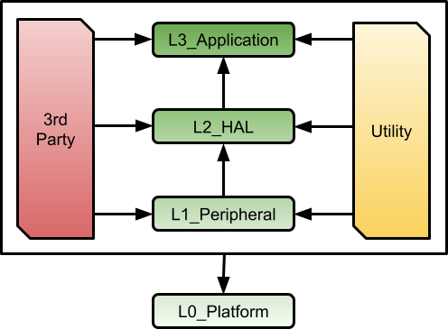

# Common Guidelines across Levels

## Hierarchy of inclusion

### Explanation

Arrows indicate which levels can include from. For example, `devices` can include
`peripherals`, and `systems` can include `devices`.

`systems` should refrain from including `peripherals`. If an
`systems` needs to include from `peripherals`, it must only take the
peripheral interface and not a specific platforms driver. `platforms` can
include everything, except testing libraries, as its startup may need code from
any of the levels. In order to hit the **light weight** goal, keep the code in
startup to an absolute minimum.

Everything can include from `utility/` and `third_party/`. Although, some third
party libraries should not be included in some library code levels. For example,
microrl, used for command line control, should not be included in anything in
`peripherals` or even `devices`. There may be consideration in the future to
separate the third party libraries into their own set of levels that match the
library levels.

This approach is meant to keep a levels of isolation between the categories of
files. Doing this can keep from circular dependencies and unreasonable coupling
between the layers.

Utilities are meant to be usable on all levels.
