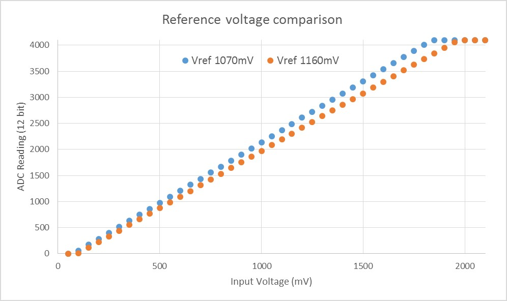
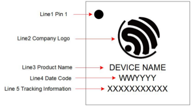

# ADC Overview

## Overview

The ESP32 integrates two 12-bit SAR ([Successive Approximation 
Register](https://en.wikipedia.org/wiki/Successive_approximation_ADC>))
ADCs supporting a total of 18 measurement channels (analog enabled pins).
The ADC driver API supports ADC1 (8 channels, attached to GPIOs 
32 - 39), and ADC2 (10 channels, attached to GPIOs 0, 2, 4, 12 - 15
and 25 - 27). However, the usage of ADC2 has some restrictions for 
the application:

1. ADC2 is used by the Wi-Fi driver. Therefore the application can 
only use ADC2 when the Wi-Fi driver has not started.
2. Some of the ADC2 pins are used as strapping pins (GPIO 0, 2, 15) 
thus cannot be used freely. Such is the case in the following 
official Development Kits:

    * [ESP32 DevKitC](https://docs.espressif.com/projects/esp-idf/en/latest/hw-reference/modules-and-boards.html#esp-modules-and-boards-esp32-devkitc) : GPIO 0 cannot be used due to external auto program circuits.
    * [ESP-WROVER-KIT](https://docs.espressif.com/projects/esp-idf/en/latest/hw-reference/modules-and-boards.html#esp-modules-and-boards-esp-wrover-kit) : GPIO 0, 2, 4 and 15 cannot be used due to external connections for different purposes.

## Configuration and Reading ADC

The ADC should be configured before reading is taken.

 - For ADC1, configure desired precision and attenuation by 
 calling functions `adc1_config_width` and 
 `adc1_config_channel_atten`. 
 - For ADC2, configure the attenuation by 
 `adc2_config_channel_atten`. The reading width of ADC2 is 
 configured every time you take the reading.
 
Attenuation configuration is done per channel, see :cpp:type:`adc1_channel_t` and :cpp:type:`adc2_channel_t`, set as a parameter of above functions.

Then it is possible to read ADC conversion result with `adc1_get_raw` and `adc2_get_raw`. Reading width of ADC2 should be set as a parameter of `adc2_get_raw` instead of in the configuration functions.

!!! note  
    Since the ADC2 is shared with the WIFI module, which has higher priority, reading operation of `adc2_get_raw` will fail between `esp_wifi_start()` and `esp_wifi_stop()`. Use the return code to see whether the reading is successful.

It is also possible to read the internal hall effect sensor via ADC1 by calling dedicated function `hall_sensor_read`. Note that even the hall sensor is internal to ESP32, reading from it uses channels 0 and 3 of ADC1 (GPIO 36 and 39). Do not connect anything else to these pins and do not change their configuration. Otherwise it may affect the measurement of low value signal from the sensor.

This API provides convenient way to configure ADC1 for reading from :doc:`ULP <../../api-guides/ulp>`. To do so, call function `adc1_ulp_enable` and then set precision and attenuation as discussed above.

There is another specific function `adc2_vref_to_gpio` used to route internal reference voltage to a GPIO pin. It comes handy to calibrate ADC reading and this is discussed in section `adc-api-adc-calibration`.

## Application Examples

Reading voltage on ADC1 channel 0 (GPIO 36):

``` c
    #include <driver/adc.h>
    ...

        adc1_config_width(ADC_WIDTH_BIT_12);
        adc1_config_channel_atten(ADC1_CHANNEL_0,ADC_ATTEN_DB_0);
        int val = adc1_get_raw(ADC1_CHANNEL_0);
```

The input voltage in above example is from 0 to 1.1V (0 dB attenuation). The input range can be extended by setting higher attenuation, see :cpp:type:`adc_atten_t`.
An example using the ADC driver including calibration (discussed below) is available in esp-idf: :example:`peripherals/adc`

Reading voltage on ADC2 channel 7 (GPIO 27):

``` c
    #include <driver/adc.h>
    ...
        
        int read_raw;
        adc2_config_channel_atten( ADC2_CHANNEL_7, ADC_ATTEN_0db );

        esp_err_t r = adc2_get_raw( ADC2_CHANNEL_7, ADC_WIDTH_12Bit, &read_raw);
        if ( r == ESP_OK ) {
            printf("%d\n", read_raw );
        } else if ( r == ESP_ERR_TIMEOUT ) {
            printf("ADC2 used by Wi-Fi.\n");
        }
```
The reading may fail due to collision with Wi-Fi, should check it.
An example using the ADC2 driver to read the output of DAC is available in esp-idf: :example:`peripherals/adc2`

Reading the internal hall effect sensor:
``` c
    #include <driver/adc.h>

    ...

        adc1_config_width(ADC_WIDTH_BIT_12);
        int val = hall_sensor_read();
```

The value read in both these examples is 12 bits wide (range 0-4095).

## Minimizing Noise

The ESP32 ADC can be sensitive to noise leading to large discrepancies in ADC readings. To minimize noise, users may connect a 0.1uF capacitor to the ADC input pad in use. Multisampling may also be used to further mitigate the effects of noise.


*Figure 1: Graph illustrating noise mitigation using capacitor and multisampling of 64 samples.*

## ADC Calibration

The :component_file:`esp_adc_cal/include/esp_adc_cal.h` API provides functions to correct for differences in measured voltages caused by variation of ADC reference voltages (Vref) between chips. Per design the ADC reference voltage is 1100mV, however the true reference voltage can range from 1000mV to 1200mV amongst different ESP32s.


*Figure 2: Graph illustrating effect of differing reference voltages on the ADC voltage curve.*

Correcting ADC readings using this API involves characterizing one of the ADCs at a given attenuation to obtain a characteristics curve (ADC-Voltage curve) that takes into account the difference in ADC reference voltage. The characteristics curve is in the form of ``y = coeff_a * x + coeff_b`` and is used to convert ADC readings to voltages in mV. Calculation of the characteristics curve is based on calibration values which can be stored in eFuse or provided by the user.

## Calibration Values

Calibration values are used to generate characteristic curves that account for the unique ADC reference voltage of a particular ESP32. There are currently three sources of calibration values. The availability of these calibration values will depend on the type and production date of the ESP32 chip/module.

* **Two Point** values represent each of the ADCs’ readings at 150mV and 850mV. To obtain more accurate calibration results these values should be measured by user and burned into eFuse ``BLOCK3``.

* **eFuse Vref** represents the true ADC reference voltage. This value is measured and burned into eFuse ``BLOCK0`` during factory calibration. 

* **Default Vref** is an estimate of the ADC reference voltage provided by the user as a parameter during characterization. If Two Point or eFuse Vref values are unavailable, **Default Vref** will be used.

Individual measurement and burning of the **eFuse Vref** has been applied to ESP32-D0WD and ESP32-D0WDQ6 chips produced on/after the 1st week of 2018. Such chips may be recognized by date codes on/later than 012018 (see Line 4 on figure below).

    
*Figure 3: ESP32 Chip Surface Marking*

!!! info 
    If you would like to purchase chips or modules with calibration, double check with distributor or Espressif directly.

If you are unable to check the date code (i.e. the chip may be enclosed inside a canned module, etc.), you can still verify if **eFuse Vref** is present by running [espefuse.py](https://github.com/espressif/esptool/wiki/espefuse) tool with ``adc_info`` parameter :

``` python
    $IDF_PATH/components/esptool_py/esptool/espefuse.py --port /dev/ttyUSB0 adc_info
```
Replace ``/dev/ttyUSB0`` with ESP32 board's port name. 

A chip that has specific **eFuse Vref** value programmed (in this case 1093mV) will be reported as follows:

    ADC VRef calibration: 1093mV

In another example below the **eFuse Vref** is not programmed:

    ADC VRef calibration: None (1100mV nominal)

For a chip with two point calibration the message will look similar to:

    ADC VRef calibration: 1149mV
    ADC readings stored in efuse BLK3:
        ADC1 Low reading  (150mV): 306
        ADC1 High reading (850mV): 3153
        ADC2 Low reading  (150mV): 389
        ADC2 High reading (850mV): 3206

## Application Example

For a full example see esp-idf: :example:`peripherals/adc`

Characterizing an ADC at a particular attenuation:

``` c
    #include "driver/adc.h"
    #include "esp_adc_cal.h"
    
    ...
    
        //Characterize ADC at particular atten
        esp_adc_cal_characteristics_t *adc_chars = calloc(1, sizeof(esp_adc_cal_characteristics_t));
        esp_adc_cal_value_t val_type = esp_adc_cal_characterize(unit, atten, ADC_WIDTH_BIT_12, DEFAULT_VREF, adc_chars);
        //Check type of calibration value used to characterize ADC
        if (val_type == ESP_ADC_CAL_VAL_EFUSE_VREF) {
            printf("eFuse Vref");
        } else if (val_type == ESP_ADC_CAL_VAL_EFUSE_TP) {
            printf("Two Point");
        } else {
            printf("Default");
        }
```
``` c
Reading an ADC then converting the reading to a voltage:

    #include "driver/adc.h"
    #include "esp_adc_cal.h"
    
    ...
        uint32_t reading =  adc1_get_raw(ADC1_CHANNEL_5);
        uint32_t voltage = esp_adc_cal_raw_to_voltage(reading, adc_chars);
```    
Routing ADC reference voltage to GPIO, so it can be manually measured (for **Default Vref**):

``` c
    #include "driver/adc.h"
    
    ...

        esp_err_t status = adc2_vref_to_gpio(GPIO_NUM_25);
        if (status == ESP_OK) {
            printf("v_ref routed to GPIO\n");
        } else {
            printf("failed to route v_ref\n");
        }
```
## GPIO Lookup Macros

There are macros available to specify the GPIO number of a ADC channel, or vice versa.
e.g.

1. ``ADC1_CHANNEL_0_GPIO_NUM`` is the GPIO number of ADC1 channel 0 (36);
2. ``ADC1_GPIO32_CHANNEL`` is the ADC1 channel number of GPIO 32 (ADC1 channel 4).

## API Reference

This reference covers three components:

* `adc-api-reference-adc-driver`
* `adc-api-reference-adc-calibration`
* `adc-api-reference-gpio-lookup-macros`

### ADC driver
### Header File 
### ADC Calibration

### GPIO Lookup Macros

